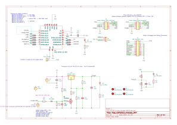
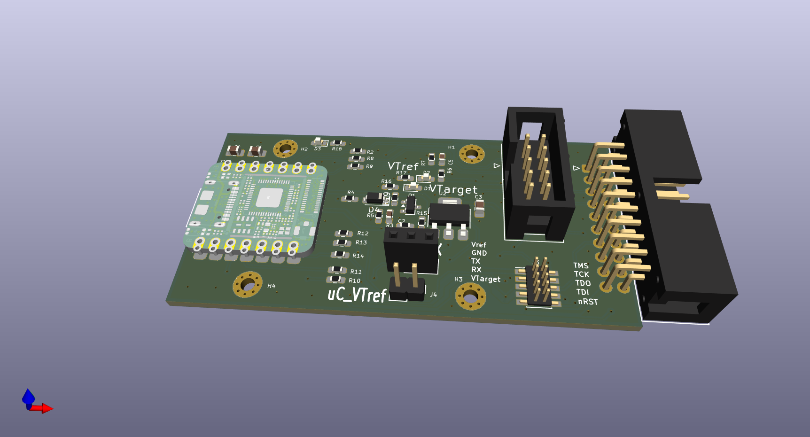

<p align="center"></p>


[](https://github.com/windowsair/wireless-esp8266-dap/actions/workflows/main.yml) master　
[](https://github.com/windowsair/wireless-esp8266-dap/actions/workflows/main.yml) develop

[](https://github.com/windowsair/wireless-esp8266-dap/LICENSE)　[](https://github.com/windowsair/wireless-esp8266-dap/pulls)　[](https://github.com/windowsair/wireless-esp8266-dap)

[中文](README_CN.md)

## Introduce

Wireless debugging with ***only one ESP Chip*** !

Realized by USBIP and CMSIS-DAP protocol stack.

> 👉 5m range, 100kb size firmware(Hex) earse and download test:

<p align="center"></p>

----

For Keil users, we now also support [elaphureLink](https://github.com/windowsair/elaphureLink). No need for usbip to start your wireless debugging!

## Feature

1. SoC Compatibility
    - [x] ESP8266/8285
    - [x] ESP32
    - [x] ESP32C3
    - [x] ESP32S3

2. Debug Communication Mode
    - [x] SWD
    - [x] JTAG

3. USB Communication Mode
    - [x] USB-HID
    - [x] WCID & WinUSB (Default)

4. Debug Trace (Uart)
    - [x] Uart TCP Bridge

5. More..
    - [x] SWD protocol based on SPI acceleration (Up to 40MHz)
    - [x] Support for [elaphureLink](https://github.com/windowsair/elaphureLink), fast Keil debug without drivers
    - [x] Support for [elaphure-dap.js](https://github.com/windowsair/elaphure-dap.js), online ARM Cortex-M firmware flash
    - [x] Support for [OpenOCD-elaphureLink](https://github.com/windowsair/openocd-elaphurelink), Get rid of USBIP!
    - [x] Support for OpenOCD/pyOCD
    - [x] ...


## Link your board

### WIFI

The default connected WIFI SSID is `DAP` or `OTA` , password `12345678`

Support for specifying multiple possible WAP. It can be added here: [wifi_configuration.h](main/wifi_configuration.h)

You can also specify your IP in the above file (We recommend using the static address binding feature of the router).


There is built-in ipv4 only mDNS server. You can access the device using `dap.local`.

> The mDNS in ESP8266 only supports ipv4.


### Debugger


<details>
<summary>ESP8266</summary>

| SWD            |        |
|----------------|--------|
| SWCLK          | GPIO14 |
| SWDIO          | GPIO13 |
| TVCC           | 3V3    |
| GND            | GND    |


--------------


| JTAG               |         |
|--------------------|---------|
| TCK                | GPIO14  |
| TMS                | GPIO13  |
| TDI                | GPIO4   |
| TDO                | GPIO16  |
| nTRST \(optional\) | GPIO0\* |
| nRESET             | GPIO5   |
| TVCC               | 3V3     |
| GND                | GND     |

--------------

| Other              |               |
|--------------------|---------------|
| LED\_WIFI\_STATUS  | GPIO15        |
| Tx                 | GPIO2         |
| Rx                 | GPIO3 (U0RXD) |

> Rx and Tx is used for uart bridge, not enabled by default.

</details>


<details>
<summary>ESP32</summary>

| SWD            |        |
|----------------|--------|
| SWCLK          | GPIO14 |
| SWDIO          | GPIO13 |
| TVCC           | 3V3    |
| GND            | GND    |


--------------


| JTAG               |         |
|--------------------|---------|
| TCK                | GPIO14  |
| TMS                | GPIO13  |
| TDI                | GPIO18  |
| TDO                | GPIO19  |
| nTRST \(optional\) | GPIO25  |
| nRESET             | GPIO26  |
| TVCC               | 3V3     |
| GND                | GND     |

--------------

| Other              |               |
|--------------------|---------------|
| LED\_WIFI\_STATUS  | GPIO27        |
| Tx                 | GPIO23        |
| Rx                 | GPIO22        |


> Rx and Tx is used for uart bridge, not enabled by default.


</details>


<details>
<summary>ESP32C3</summary>

| SWD            |        |
|----------------|--------|
| SWCLK          | GPIO6  |
| SWDIO          | GPIO7  |
| TVCC           | 3V3    |
| GND            | GND    |


--------------


| JTAG               |         |
|--------------------|---------|
| TCK                | GPIO6   |
| TMS                | GPIO7   |
| TDI                | GPIO9   |
| TDO                | GPIO8   |
| nTRST \(optional\) | GPIO4   |
| nRESET             | GPIO5   |
| TVCC               | 3V3     |
| GND                | GND     |

--------------

| Other              |               |
|--------------------|---------------|
| LED\_WIFI\_STATUS      | GPIO10        |
| VTarget Sense          | GPIO2 (ADC0)  |
| VTarget Control (PWM)  | GPIO3         |
| Tx                     | GPIO21        |
| Rx                     | GPIO20        |


> Rx and Tx is used for uart bridge, not enabled by default.
> 
> VTarget is sensed via a 1/2 voltage divider on GPIO2 (ADC0). Use DAP Vendor Command 0x81 to read target voltage.
> 
> VTarget voltage can be controlled via PWM on GPIO3 (1.25V-5.0V range). Use DAP Vendor Command 0x82 to set target voltage.
> 
> **Note for XIAO-ESP32-C3:** UART pins are GPIO21 (D6/TX) and GPIO20 (D7/RX).


</details>


<details>
<summary>ESP32S3</summary>

| SWD            |        |
|----------------|--------|
| SWCLK          | GPIO12 |
| SWDIO          | GPIO11 |
| TVCC           | 3V3    |
| GND            | GND    |


--------------


| JTAG               |        |
|--------------------|--------|
| TCK                | GPIO12 |
| TMS                | GPIO11 |
| TDI                | GPIO10 |
| TDO                | GPIO9  |
| nTRST \(optional\) | GPIO14 |
| nRESET             | GPIO13 |
| TVCC               | 3V3    |
| GND                | GND    |


</details>

----

## Hardware Reference

### ESP8266 Reference Design

Here we provide a simple example for reference:


### ESP32-C3 XIAO Reference Design

A complete hardware design for the Seeed Studio XIAO ESP32-C3 module is available with the following features:

- **Multiple Debug Connector Options:**
  - **J3:** 10-pin Cortex Debug (1.27mm pitch, SMD) - Compact SMD connector
  - **J1:** 10-pin Cortex Debug (2.54mm pitch, IDC) - Standard through-hole
  - **J2:** 20-pin ARM Standard JTAG (2.54mm pitch, IDC) - Compatible with J-Link and other standard debuggers
- **VTarget Voltage Sensing** via 1/2 voltage divider on GPIO2 (supports 0-6.6V range)
- **UART Bridge** on GPIO20 (RX/D7) and GPIO21 (TX/D6)
- **3.3V Target Power Supply** option with MOSFET switch
- Full schematic and PCB layout in KiCAD format

**Schematic:** [circuit_ESP32C3_Xiao/ESP32C3_Xiao_wireless_DAP.kicad_sch](circuit_ESP32C3_Xiao/ESP32C3_Xiao_wireless_DAP.kicad_sch)

**Schematic PDF:** [circuit_ESP32C3_Xiao/documentations/ESP32C3_Xiao_wireless_DAP.pdf](circuit_ESP32C3_Xiao/documentations/ESP32C3_Xiao_wireless_DAP.pdf)

**Schematic Diagram:**



**Additional Documentation:** [circuit_ESP32C3_Xiao/doc/](circuit_ESP32C3_Xiao/doc/) includes ARM JTAG connector pinouts and component datasheets

**PCBA Preview:**



**Key Features:**
- Seeed Studio XIAO ESP32-C3 module
- Three connector options for maximum compatibility:
  - 1.27mm pitch for space-constrained applications
  - 2.54mm pitch 10-pin for standard probe compatibility
  - 2.54mm pitch 20-pin for J-Link and ARM standard debuggers
- Target voltage monitoring via DAP Vendor Command (0x81)
- Bi-directional UART bridge for SWO/RTT trace capture
- Level shifter compatible design (3.3V target support)
- Compatible with OpenOCD, pyOCD, Keil, and other standard ARM debugging tools

**Programmable VTarget Implementation:**

For ESP32-C3 XIAO designs, a programmable target voltage feature (1.25V-5V) is available using PWM-controlled voltage regulation. See the detailed implementation guide: [VTARGET_PWM_IMPLEMENTATION.md](VTARGET_PWM_IMPLEMENTATION.md)

***Alternatively, you can connect directly with wires as we gave at the beginning, without additional circuits.***

Additional hardware reference designs are available from contributors in the [circuit](circuit) folder.

------


## Build And Flash

You can build locally or use Github Action to build online and then download firmware to flash.

### Build with Github Action Online

See: [Build with Github Action](https://github.com/windowsair/wireless-esp8266-dap/wiki/Build-with-Github-Action)


### General build and Flash

<details>
<summary>ESP8266</summary>

1. Get ESP8266 RTOS Software Development Kit

    The SDK is already included in the project. Please don't use other versions of the SDK.

2. Build & Flash

    Build with ESP-IDF build system.
    More information can be found at the following link: [Build System](https://docs.espressif.com/projects/esp-idf/en/latest/api-guides/build-system.html "Build System")

The following example shows a possible way to build on Windows:

```bash
# Build
python ./idf.py build
# Flash
python ./idf.py -p /dev/ttyS5 flash
```

</details>


<details>
<summary>ESP32/ESP32C3/ESP32S3</summary>

1. Get ESP-IDF

    For now, please use ESP-IDF v4.4.2 or later: https://github.com/espressif/esp-idf/releases/tag/v4.4.2
    
    Installation guides:
    - Linux/macOS: https://docs.espressif.com/projects/esp-idf/en/latest/esp32/get-started/linux-macos-setup.html
    - Windows: https://docs.espressif.com/projects/esp-idf/en/latest/esp32/get-started/windows-setup.html

2. Build & Flash

    Build with ESP-IDF build system.
    More information can be found at the following link: [Build System](https://docs.espressif.com/projects/esp-idf/en/latest/api-guides/build-system.html "Build System")

**Linux/macOS:**

```bash
# Set build target (choose one)
idf.py set-target esp32      # For ESP32
idf.py set-target esp32c3    # For ESP32-C3
idf.py set-target esp32s3    # For ESP32-S3

# Build
idf.py build

# Flash (replace with your port, e.g., /dev/ttyUSB0, /dev/ttyACM0)
idf.py -p /dev/ttyUSB0 flash

# Optional: Monitor serial output
idf.py -p /dev/ttyUSB0 monitor
```

**Windows:**

```bash
# Set build target (choose one)
idf.py set-target esp32      # For ESP32
idf.py set-target esp32c3    # For ESP32-C3
idf.py set-target esp32s3    # For ESP32-S3

# Build
idf.py build

# Flash (replace COM5 with your port)
idf.py -p COM5 flash

# Optional: Monitor serial output
idf.py -p COM5 monitor
```

> **Note:** The `idf.py` in the project root directory is only applicable to the old ESP8266 target. For ESP32/ESP32-C3/ESP32-S3, use the `idf.py` from your ESP-IDF installation (should be in your PATH after running `export.sh` on Linux/macOS or using the ESP-IDF command prompt on Windows).

</details>


> We also provided sample firmware for quick evaluation. See [Releases](https://github.com/windowsair/wireless-esp8266-dap/releases)


## Usage

1. Get USBIP project

- Windows: [usbip-win](https://github.com/cezanne/usbip-win) .
- Linux: Distributed as part of the Linux kernel, but we have not yet tested on Linux platform, and the following instructions are all under Windows platform.

2. Start ESP chip and connect it to the device to be debugged

3. Connect it with usbip:

```bash
# HID Mode only
# for pre-compiled version on SourceForge
# or usbip old version
.\usbip.exe -D -a <your-esp-device-ip-address>  1-1

# 👉 Recommend
# HID Mode Or WinUSB Mode
# for usbip-win 0.3.0 kmdf ude
.\usbip.exe attach_ude -r <your-esp-device-ip-address> -b 1-1

```

If all goes well, you should see your device connected.


Here, we use MDK for testing:


------

## FAQ

### Keil is showing a "RDDI-DAP ERROR" or "SWD/JTAG Communication Failure" message.

1. Check your line connection. Don't forget the 3v3 connection cable.
2. Check that your network connection is stable.


### DAP is slow or often abnormal.

Note that this project is sensitive to the network environment. If you are using a hotspot on your computer, you can try using network analyzer such as wireshark to observe the status of your AP network. During the idle time, the network should stay silent, while in the working state, there should be no too much packet loss.

Some LAN broadcast packets can cause serious impact, including:
- DropBox LAN Sync
- Logitech Arx Control
- ...

For ESP8266, this is not far from UDP FLOOD...😰

It is also affected by the surrounding radio environment, your AP situation (some NICs have terrible AP performance), distance, etc.


----

## Document

### Speed Strategy

The maximum rate of esp8266 pure IO is about 2MHz.
When you select max clock, we will take the following actions:

- `clock < 2Mhz` : Similar to the clock speed you choose.
- `2MHz <= clock < 10MHz` : Use the fastest pure IO speed.
- `clock >= 10MHz` : SPI acceleration using 40MHz clock.

> Note that the most significant speed constraint of this project is still the TCP connection speed.


### For OpenOCD user

This project was originally designed to run on Keil, but now you can also perform firmware flash on OpenOCD.

```bash
> halt
> flash write_image [erase] [unlock] filename [offset] [type]
```

> pyOCD is now supported.

### System OTA

When this project is updated, you can update the firmware over the air.

Visit the following website for OTA operations: [online OTA](http://corsacota.surge.sh/?address=dap.local:3241)


For most devices, you don't need to care about flash size. However, improper setting of the flash size may cause the OTA to fail. In this case, please change the flash size with `idf.py menuconfig`, or modify `sdkconfig`:

```
# Choose a flash size.
CONFIG_ESPTOOLPY_FLASHSIZE_1MB=y
CONFIG_ESPTOOLPY_FLASHSIZE_2MB=y
CONFIG_ESPTOOLPY_FLASHSIZE_4MB=y
CONFIG_ESPTOOLPY_FLASHSIZE_8MB=y
CONFIG_ESPTOOLPY_FLASHSIZE_16MB=y

# Then set a flash size
CONFIG_ESPTOOLPY_FLASHSIZE="2MB"
```

If flash size is 2MB, the sdkconfig file might look like this:

```
CONFIG_ESPTOOLPY_FLASHSIZE_2MB=y
CONFIG_ESPTOOLPY_FLASHSIZE="2MB"
```


For devices with 1MB flash size such as ESP8285, the following changes must be made:

```
CONFIG_PARTITION_TABLE_FILENAME="partitions_two_ota.1MB.csv"
CONFIG_ESPTOOLPY_FLASHSIZE_1MB=y
CONFIG_ESPTOOLPY_FLASHSIZE="1MB"
CONFIG_ESP8266_BOOT_COPY_APP=y
```

The flash size of the board can be checked with the esptool.py tool:

```bash
esptool.py -p (PORT) flash_id
```

### Uart TCP Bridge

This feature provides a bridge between TCP and Uart:
```
Send data   ->  TCP  ->  Uart TX -> external devices

Recv data   <-  TCP  <-  Uart Rx <- external devices
```


When the TCP connection is established, bridge will try to resolve the text sent for the first packet. When the text is a valid baud rate, bridge will switch to it.
For example, sending the ASCII text `115200` will switch the baud rate to 115200.


For performance reasons, this feature is not enabled by default. You can modify [wifi_configuration.h](main/wifi_configuration.h) to turn it on.


### elaphure-dap.js

For the ESP8266, this feature is turned off by default. You can turn it on in menuconfig:

```
CONFIG_USE_WEBSOCKET_DAP=y
```

----

## Develop

Check other branches to know the latest development progress.

Any kind of contribute is welcome, including but not limited to new features, ideas about circuits, documentation.

You can also ask questions to make this project better.

- [New issues](https://github.com/windowsair/wireless-esp8266-dap/issues)
- [New pull](https://github.com/windowsair/wireless-esp8266-dap/pulls)


### Issue

2020.12.1

TCP transmission speed needs to be further improved.

2020.11.11

Winusb is now available, but it is very slow.


2020.2.4

Due to the limitation of USB-HID (I'm not sure if this is a problem with USBIP or Windows), now each URB packet can only reach 255 bytes (About 1MBps bandwidth), which has not reached the upper limit of ESP8266 transmission bandwidth.

I now have an idea to construct a Man-in-the-middle between the two to forward traffic, thereby increasing the bandwidth of each transmission.

2020.1.31

At present, the adaptation to WCID, WinUSB, etc. has all been completed. However, when transmitting data on the endpoint, we received an error message from USBIP. This is most likely a problem with the USBIP project itself.

Due to the completeness of the USBIP protocol document, we have not yet understood its role in the Bulk transmission process, which may also lead to errors in subsequent processes.

We will continue to try to make it work on USB HID. Once the USBIP problem is solved, we will immediately transfer it to work on WinUSB


------

## Credit


Credits to the following project, people and organizations:

> - https://github.com/thevoidnn/esp8266-wifi-cmsis-dap for adapter firmware based on CMSIS-DAP v1.0
> - https://github.com/ARM-software/CMSIS_5 for CMSIS
> - https://github.com/cezanne/usbip-win for usbip windows


- [@HeavenSpree](https://www.github.com/HeavenSpree)
- [@Zy19930907](https://www.github.com/Zy19930907)
- [@caiguang1997](https://www.github.com/caiguang1997)
- [@ZhuYanzhen1](https://www.github.com/ZhuYanzhen1)


## License

[MIT LICENSE](LICENSE)

